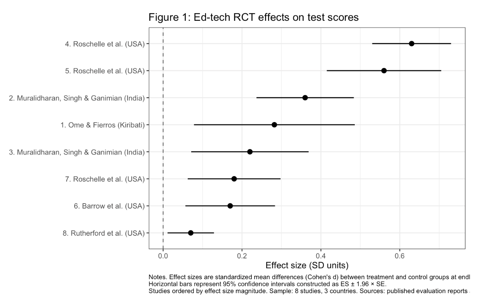
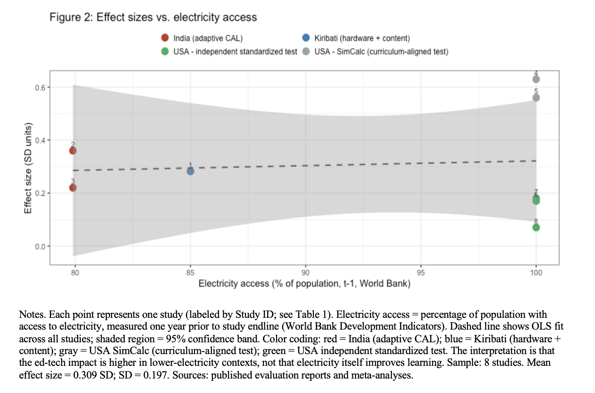
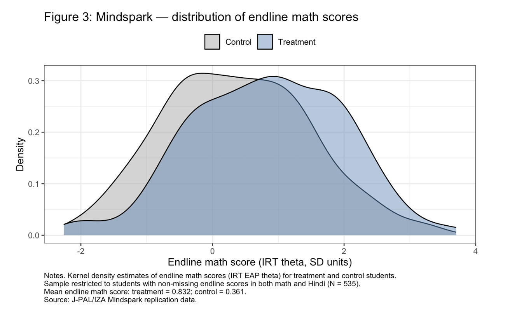

::: {.project-header}
::: {.container}

[← Back to Research](../research.qmd){.back-link}

# Does Educational Technology Narrow or Widen Achievement Gaps?

::: {.project-meta}
<strong>Course:</strong> Quantitative Analyses of Public Policy Issues
<strong>Instructor:</strong> Prof. Gaurav Khanna
<strong>Term:</strong> Winter 2026
<strong>Tools:</strong> R · metafor · J-PAL/IZA Data
:::

:::
:::

::: {.container style="max-width: 860px; margin: 0 auto; padding-bottom: 5rem;"}

## The Question

Does educational technology help the students who need it most — or does it widen the gap between the already-advantaged and everyone else? And does the answer depend on where in the world the program is deployed?

## The Short Answer

Ed-tech appears to work best precisely where it's least commonly deployed. Lower infrastructure is associated with larger learning gains. And within programs, the most disadvantaged students benefit at least as much as their better-off peers — sometimes more.

## Two Analyses, One Argument

This paper combines two complementary approaches.

**Part I — Cross-National Mini Meta-Analysis:** I assembled a dataset of 8 randomized controlled trials across three countries (India, USA, Kiribati), extracted standardized effect sizes, and ran a meta-regression to test whether ed-tech effects vary with country-level infrastructure — specifically electricity access.

**Part II — Mindspark Microdata:** Using the public replication dataset from Muralidharan, Singh & Ganimian (2019) via J-PAL/IZA (N=535 students across 15 Delhi government schools), I tested whether the Mindspark adaptive learning program produces larger gains for low-SES and low-baseline-achievement students.

## The Puzzle That Started It All

The variation in Figure 1 is what this paper sets out to explain. Some programs produce gains of over 0.6 standard deviations. Others barely move the needle. Why?

*Figure 1: Forest plot of standardized effect sizes (Cohen's d) across 8 RCTs, with 95% confidence intervals. Studies ordered by effect size magnitude. The two outliers at the top are SimCalc studies — measured on curriculum-aligned tests, which turns out to be the most important distinction in the dataset.*

---

## The Key Finding: Infrastructure Matters

The most important variable in the meta-regression isn't GDP or literacy rate — it's electricity access, which sits directly on the causal pathway for ed-tech implementation. A child can't benefit from an adaptive learning device without reliable power.

*Figure 2: Effect sizes vs. electricity access, color-coded by intervention type. The gradient shows that lower infrastructure settings are associated with larger learning gains on independent standardized assessments, after controlling for intervention type. This doesn't mean electricity causes learning — it's a proxy for the full bundle of educational quality conditions that determine how much value technology adds.*

---

The two SimCalc studies (gray) use curriculum-aligned outcome tests — assessments built around the specific intervention content. This is not a flaw, but it means those gains aren't directly comparable to programs measured on independent benchmarks. Treating this as a variable to control for rather than a reason to discard those studies reveals the infrastructure gradient more cleanly.

The preferred meta-regression specification finds an electricity access coefficient of **-0.010 SD per percentage point** — meaning the ~20 percentage point difference between India (79.9%) and the US (100%) implies roughly 0.20 SD larger effects in the Indian context, holding intervention type constant. That's a substantively meaningful gap.

## Does Mindspark Widen Gaps?

The short answer: no.

Average treatment effects of **0.527 SD in math** and **0.266 SD in Hindi** on independent IRT assessments — closely replicating the published results and confirming the data preparation is correct before running the heterogeneity tests.

*Figure 3: Distribution of endline math scores by treatment status. The treatment distribution is visibly shifted right. Mean endline math: treatment = 0.832, control = 0.361.*

---

The heterogeneity regressions interact treatment with SES and baseline achievement. All four interaction coefficients are small and statistically insignificant — but three of four point in the direction of the most disadvantaged students benefiting relatively more. The program does not produce smaller effects for low-SES or low-baseline students. Whether it narrows gaps in a statistically detectable way requires a larger sample.

## What This Means

In low-infrastructure contexts — conflict-displaced schools, climate-displaced communities, humanitarian education programs — students span multiple grade levels in a single classroom, teachers face overwhelming implementation challenges, and the counterfactual to technology is instruction that genuinely cannot meet students where they are. If ed-tech effects are largest precisely where infrastructure is most constrained, programs like Mindspark may offer unusually high returns in exactly these settings.

The policy implication: deploy in low-infrastructure contexts, choose adaptive over hardware-only where resources allow, and expect near-universal gains rather than gains concentrated among the already-advantaged.

## Paper & Code

[Read Full Paper (PDF)](../assets/edtech-meta-analysis-paper.pdf){target="_blank"}

:::
