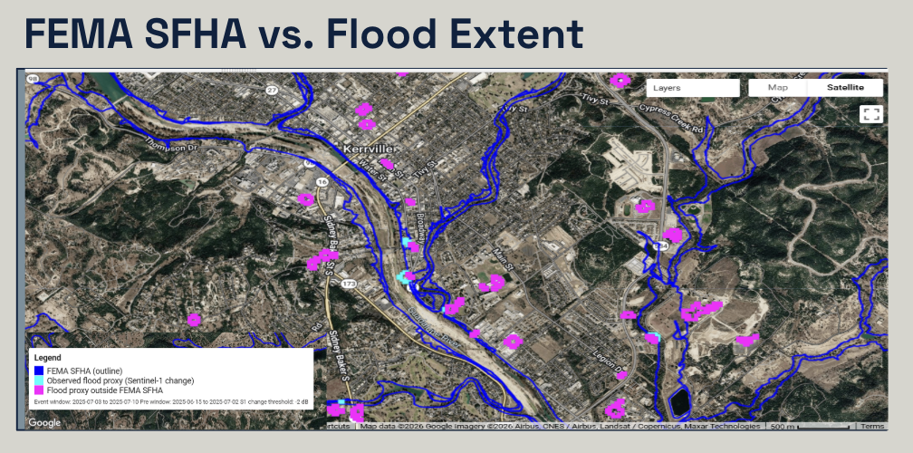
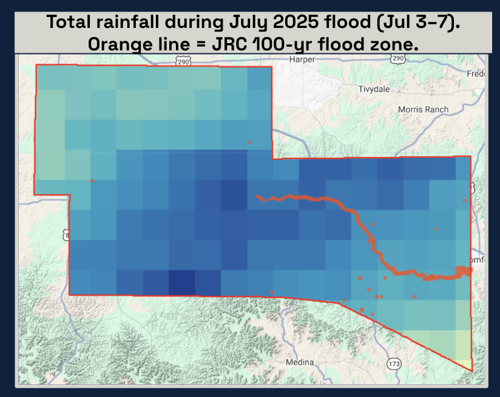

::: {.project-header}
::: {.container}

[← Back to Research](../research.qmd){.back-link}

# Flood Risk & Hazard Mapping, Kerr County TX

::: {.project-meta}
<strong>Course:</strong> Advanced GIS & Remote Sensing
<strong>Instructor:</strong> Prof. Morgan Levy
<strong>Term:</strong> Winter 2026
<strong>Tools:</strong> Google Earth Engine · CHIRPS · Sentinel-1 SAR · QGIS
:::

:::
:::

::: {.container style="max-width: 860px; margin: 0 auto; padding-bottom: 5rem;"}

## The Question

Can satellite-derived precipitation data expose structural gaps in FEMA's regulatory flood maps — and what do those gaps mean for communities that just experienced a catastrophic flood?

## Why It Matters

On July 4, 2025, a catastrophic flash flood struck Kerr County, Texas — killing 27+ people at Camp Mystic, many in structures that were **outside FEMA's mapped flood zones**. FEMA's Flood Insurance Rate Maps had not been substantially updated in decades. Built on historical river hydrology data, they have no account for rainfall intensity patterns, upstream land use change, or shifting climate conditions.

This is not a Kerr County problem. Approximately 75% of U.S. flood insurance maps are considered outdated. The binary SFHA zoning framework — you're either in the flood zone or you're not — leaves millions of at-risk properties uninsured and countless communities underprepared. The July 4 disaster made this structural failure impossible to ignore.

## My Contribution

This analysis was completed as part of a six-person team project. The work shown here represents my individual contributions: the CHIRPS precipitation analysis and the FEMA SFHA boundary audit against satellite-observed flood extent.

## Data Sources

| Dataset | Source | What it measures |
|---|---|---|
| CHIRPS precipitation | UCSB Climate Hazards Group | Daily rainfall estimates, 1981–present |
| FEMA NFHL | FEMA | Regulatory Special Flood Hazard Areas |
| JRC GLOFAS | European Commission | Modeled 100-year flood hazard zones |

## Methodology

**CHIRPS precipitation analysis:**
I wrote JavaScript scripts in Google Earth Engine to filter CHIRPS daily precipitation grids by date range (July 3–7, 2025) and geographic boundary, extracting total accumulated rainfall across Kerr County at 5km resolution. This allowed direct comparison of where the heaviest rainfall fell against where FEMA's regulatory risk boundaries are drawn.

**FEMA SFHA audit:**
I overlaid FEMA's Special Flood Hazard Area boundaries against the CHIRPS precipitation surface and JRC 100-year modeled flood zones to identify structural gaps — places where observed precipitation intensity exceeded what the regulatory framework would predict, and where flood-affected areas extended beyond FEMA's mapped boundaries.

## Results

*FEMA Special Flood Hazard Area (SFHA) boundaries vs. satellite-observed flood extent, Kerr County TX. The July 4, 2025 Camp Mystic flood extended significantly beyond FEMA's regulatory boundaries — many affected structures were outside the mapped flood zone and therefore uninsured.*

---

*Total CHIRPS precipitation accumulation, July 3–7 2025. The heaviest rainfall fell outside the JRC-modeled 100-year flood hazard corridor — a structural gap between where rain falls and where regulatory risk is mapped.*
---

## Key Findings

Two structural gaps emerge clearly from the analysis:

**Precipitation is not modeled in FEMA maps.** FEMA predicts where water goes after entering river channels — not where rainfall is heaviest. The CHIRPS surface shows dramatic within-county variation that FEMA's static boundaries cannot capture.

**Binary zoning creates false safety.** The SFHA/non-SFHA distinction communicates certainty where none exists. Many of the Camp Mystic structures were outside the SFHA — uninsured, and with no regulatory signal that they were at risk.

## Policy Implications

The natural next step is a multi-criteria flood susceptibility index combining precipitation intensity, topography, and land cover change to establish a flash flood risk specturm. Static regulatory maps need dynamic, satellite-informed updates to reflect actual risk distributions. The tools exist. The question is whether the regulatory framework can keep pace.

:::
