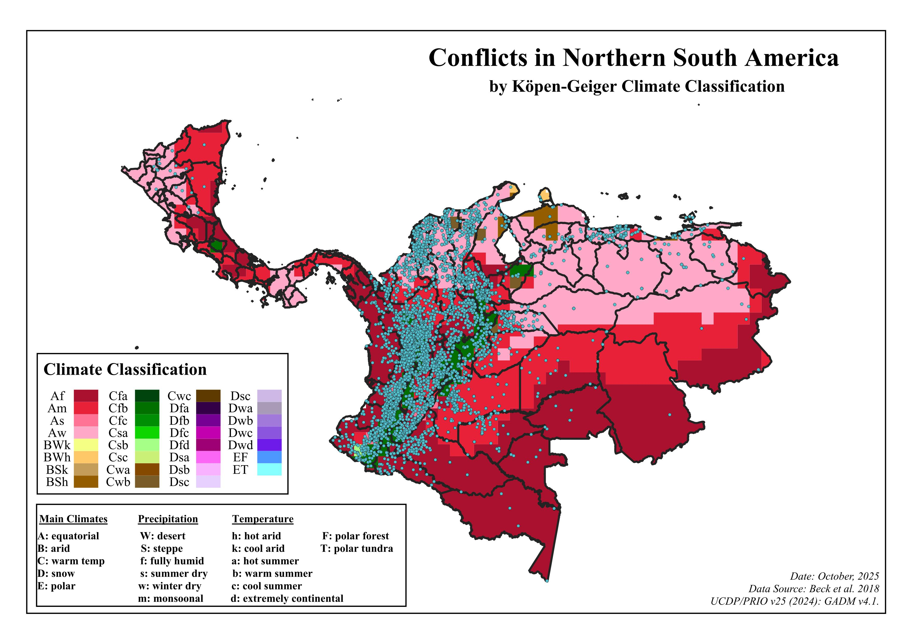

::: {.project-header}
::: {.container}

[← Back to Research](../research.qmd){.back-link}

# Conflicts in Northern South America by Köppen-Geiger Climate Classification

::: {.project-meta}
<strong>Course:</strong> GIS & Spatial Data Analysis
<strong>Instructor:</strong> Prof. Gordon McCord
<strong>Term:</strong> Fall 2025
<strong>Tools:</strong> QGIS · UCDP/PRIO v25 · Beck et al. 2018
:::

:::
:::

::: {.container style="max-width: 860px; margin: 0 auto; padding-bottom: 5rem;"}

## The Question

Do violent conflict events cluster in specific climate zones — and what does the spatial overlap between climate type and conflict density tell us about environmental stress as a threat multiplier?

## Overview

This analysis overlays the UCDP/PRIO v25 (2024) violent conflict event dataset with Beck et al. (2018) Köppen-Geiger climate classification zones across Northern South America — a region chosen for its unusually high conflict density and stark contrasts between adjacent climate zones.

## Data Sources

| Dataset | Source |
|---|---|
| Köppen-Geiger climate zones | Beck et al. (2018), 1-km resolution |
| Violent conflict events | UCDP/PRIO Armed Conflict Dataset v25 (2024) |
| Regional boundary | GADM v4.1 |

## Methodology

After cleaning the Beck et al. climate data in Excel to remove extraneous columns, I imported both layers into QGIS and used Extract by Location and Clip tools to isolate conflict points within Northern South America. The Count Points in Polygon tool calculated total violent conflict events per distinct Köppen-Geiger climate zone. Results were exported to Excel and summarized with a pivot table to produce quantitative conflict counts by zone.

## Results

*Conflicts in Northern South America by Köppen-Geiger Climate Classification. Blue dots = UCDP/PRIO conflict events (2024). Background = climate zones per Beck et al. (2018). Data: UCDP/PRIO v25 (2024), GADM v4.1.*

---

## Key Findings

The equatorial savanna (Aw), equatorial fully humid (Af), and equatorial monsoon (Am) zones exhibit the highest conflict concentration — regions with moderate to high rainfall and strong agricultural potential. Arid zones (BWh, BSh) show substantially fewer conflict events, likely reflecting lower population densities and limited agricultural productivity.

The pattern supports the climate-conflict hypothesis: climatic variability interacts with political and economic factors to shape instability. As Chassang and Padró i Miquel (2009) note, adverse climatic conditions reduce crop yields, raise food prices, and amplify the opportunity cost of rebellion — particularly when compounded by weak governance. Environmental stressors act not as isolated causes of violence but as threat multipliers that exacerbate existing vulnerabilities.

## Paper

[Read Full Paper (PDF)](../assets/south-america-conflicts-paper.pdf){target="_blank"}

:::
