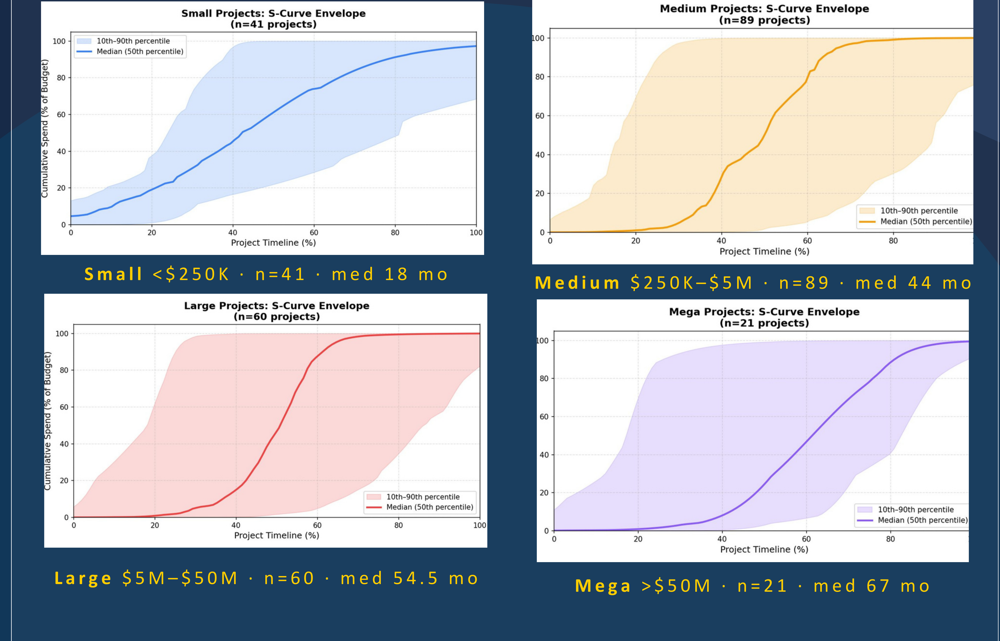
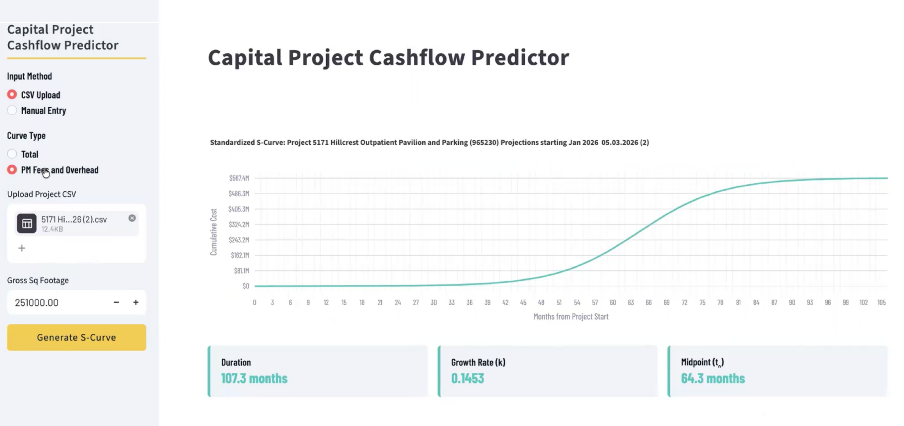

::: {.project-header}
::: {.container}

[← Back to Research](../research.qmd){.back-link}

# Capital Project Cashflow Predictor — UCSD Health

::: {.project-meta}
<strong>Program:</strong> i4X Fellowship, The Basement (Blackstone LaunchPad), UCSD
<strong>Client:</strong> UCSD Health, Capital Program Management
<strong>Term:</strong> Dec 2025 – May 2026
<strong>Tools:</strong> Python · R · Random Forest · LightGBM · Streamlit · GitHub
:::

:::
:::

::: {.container style="max-width: 860px; margin: 0 auto; padding-bottom: 5rem;"}

## The Question

UCSD Health's Capital Program Management (CPM) office oversees a $6.6B portfolio of construction projects, ranging from sub-$250K renovations to $50M+ builds. Without a forecasting tool, project managers approving new proposals were relying on intuition to estimate how a project's spend would actually unfold over time. Could 14 years of historical project data train a model accurate enough to replace that guesswork?

## The Data Problem

CPM's history lived in 14 years of multi-format eBuilder spreadsheets. Of 869 projects with complete records, only 228 also had the gross square footage data needed to train a predictive model — cleaning and reconciling that data was as much the project's real bottleneck as the modeling itself.

## Approach

Working directly with CPM's Executive Director, Chris Hickman, I led a 6-person i4X Fellowship team — Gayathri Kuniyil, Harshini Kanakala, Jai Anish Penumarthi, Jiya Sreejesh, Tom Ragus, and me — through four stages:

1. **Tier classification** — splitting the portfolio into Small (<$250K), Medium ($250K–$5M), Large ($5M–$50M), and Mega (>$50M) projects, since spend behavior differs sharply by scale.
2. **S-curve modeling** — fitting a logistic growth curve to each project to extract a growth rate (k) and spending midpoint (t₀), reaching total R² values of roughly 0.62–0.76.
3. **Line 6 overhead analysis** — quantifying CPM's internal FD&C overhead as a share of total project cost, by tier.
4. **Deployment** — an ensemble of Random Forest and LightGBM models, using square footage as the primary feature, packaged into a live web tool for PMs.

## Results

::: {.project-visual}

S-curve spend envelopes by project tier (median + 10th–90th percentile band, n=41/89/60/21). Median project duration scales from 18 months for Small projects to 67 months for Mega projects — and CPM's internal overhead share moves the opposite direction, from 39.1% of total cost on Small projects down to 1.7% on Mega projects, meaning fee estimates can be set with far more confidence as projects scale up.

:::

::: {.project-visual}

The deployed Capital Project Cashflow Predictor. A project manager uploads a budget CSV (or enters figures manually) along with gross square footage, and the tool returns a standardized S-curve forecast — duration, growth rate, and spending midpoint — for that specific project.

:::

## Outcomes

The team shipped a production tool now in use by the CPM team, presenting final results to Chris Hickman and CPM leadership at the close of the Spring 2026 fellowship term. Next steps identified for the project: scaling the model across the full UC system, and integrating NLP to auto-extract project features directly from proposal descriptions.

## Team & Role

Six-person i4X Fellowship team: Gayathri Kuniyil, Harshini Kanakala, Jai Anish Penumarthi, Jiya Sreejesh, Tom Ragus, and Max Avramis. I led research design, the analytical framework, and stakeholder presentations to CPM leadership; the tool is deployed and maintained under Tom Ragus's GitHub, reflecting how the team split up deployment ownership.

## Try It / See the Code

[Live Tool: Capital Project Cashflow Predictor](https://i4x-capital-project-cashflow-predictor.streamlit.app/){target="_blank"}
[Model Backend (GitHub)](https://github.com/tomragus/i4X-CPM-Model-Backend){target="_blank"}
[View Full Poster (PDF)](../assets/CPM_Poster.pdf){target="_blank"}

:::
